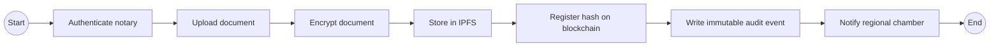

# BPMN Business Process

```mermaid
flowchart LR
  Start((Start)) --> Auth[Authenticate notary]
  Auth --> Upload[Upload document]
  Upload --> Encrypt[Encrypt document]
  Encrypt --> Store[Store in IPFS]
  Store --> Register[Register hash on blockchain]
  Register --> Audit[Write immutable audit event]
  Audit --> Notify[Notify regional chamber]
  Notify --> End((End))
```
