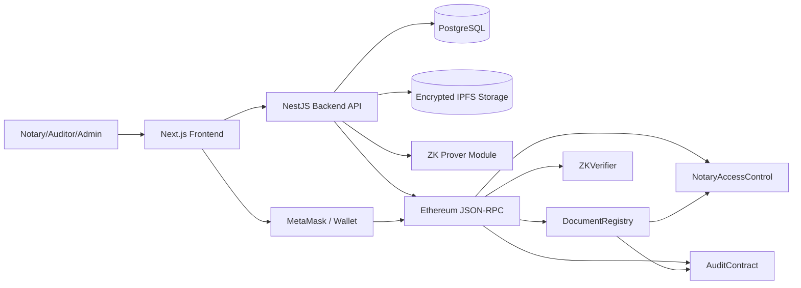

# UML Component Diagram

```mermaid
flowchart LR
  User[Notary/Auditor/Admin] --> FE[Next.js Frontend]
  FE --> API[NestJS Backend API]
  FE --> Wallet[MetaMask / Wallet]
  API --> PG[(PostgreSQL)]
  API --> IPFS[(Encrypted IPFS Storage)]
  API --> ZK[ZK Prover Module]
  API --> RPC[Ethereum JSON-RPC]
  Wallet --> RPC
  RPC --> AC[NotaryAccessControl]
  RPC --> DR[DocumentRegistry]
  RPC --> AU[AuditContract]
  RPC --> ZKV[ZKVerifier]
  DR --> AU
  DR --> AC
```
