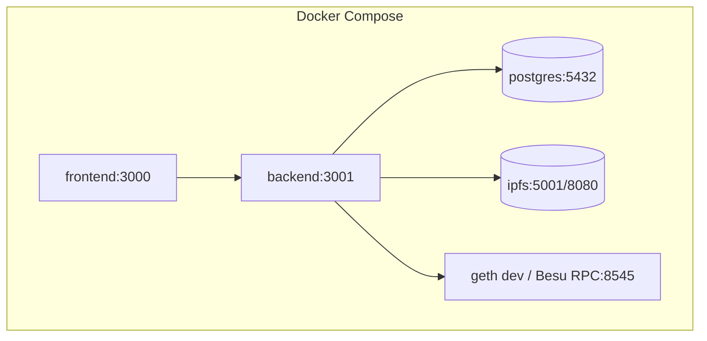

# Deployment Diagram

```mermaid
flowchart TB
  subgraph Docker Compose
    FE[frontend:3000]
    BE[backend:3001]
    PG[(postgres:5432)]
    IPFS[(ipfs:5001/8080)]
    ETH[geth dev / Besu RPC:8545]
  end
  FE --> BE
  BE --> PG
  BE --> IPFS
  BE --> ETH
```
