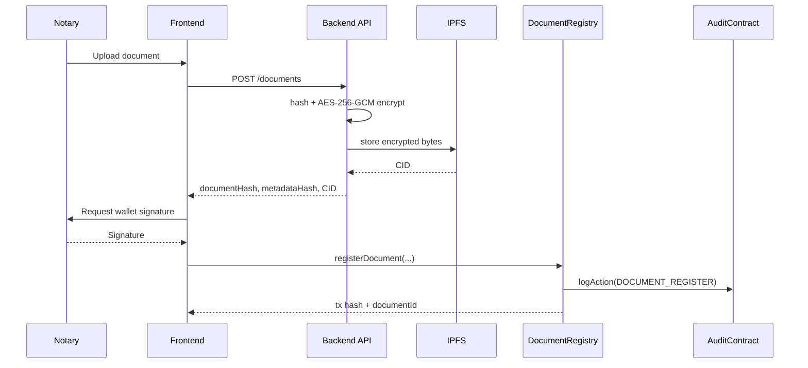
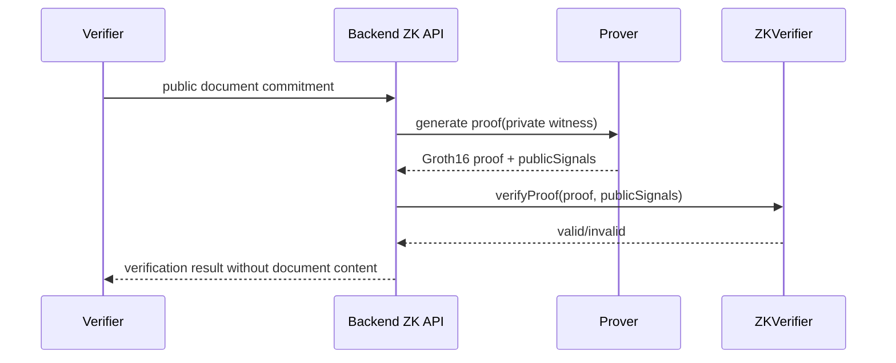

# Sequence Diagrams

## Document registration

```mermaid
sequenceDiagram
  participant N as Notary
  participant FE as Frontend
  participant API as Backend API
  participant IPFS as IPFS
  participant BC as DocumentRegistry
  participant AUD as AuditContract
  N->>FE: Upload document
  FE->>API: POST /documents
  API->>API: hash + AES-256-GCM encrypt
  API->>IPFS: store encrypted bytes
  IPFS-->>API: CID
  API-->>FE: documentHash, metadataHash, CID
  FE->>N: Request wallet signature
  N-->>FE: Signature
  FE->>BC: registerDocument(...)
  BC->>AUD: logAction(DOCUMENT_REGISTER)
  BC-->>FE: tx hash + documentId
```

## Zero-knowledge verification

```mermaid
sequenceDiagram
  participant V as Verifier
  participant API as Backend ZK API
  participant P as Prover
  participant SC as ZKVerifier
  V->>API: public document commitment
  API->>P: generate proof(private witness)
  P-->>API: Groth16 proof + publicSignals
  API->>SC: verifyProof(proof, publicSignals)
  SC-->>API: valid/invalid
  API-->>V: verification result without document content
```
